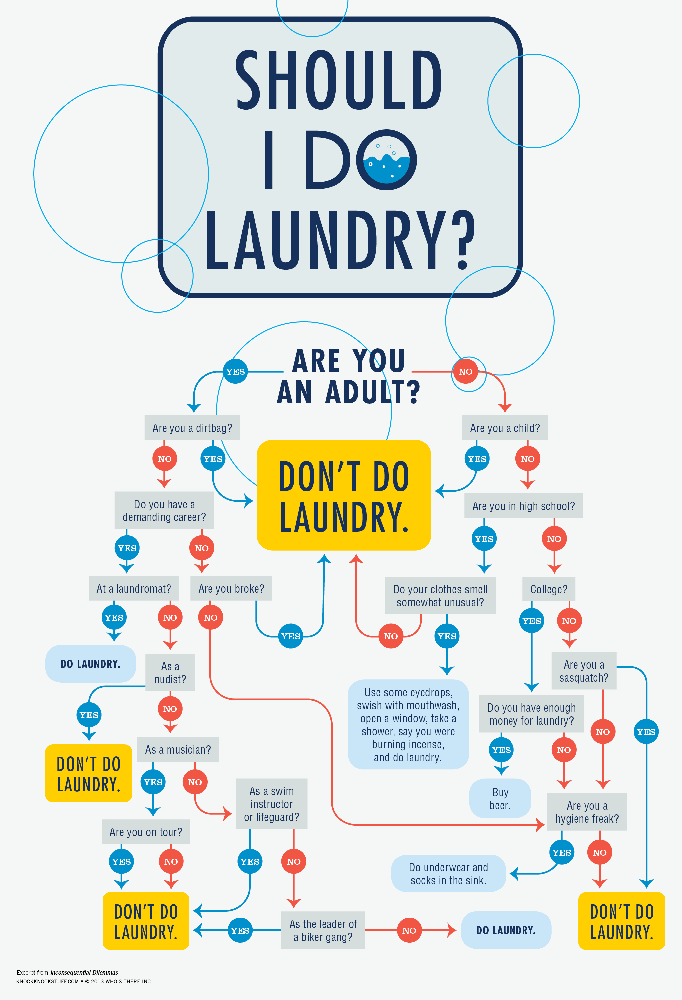

# Data Science Recipes

In this repo we implement various algorithms useful for data science:
1. Parallelized k-fold cross validation.
2. Kernelized Logistic Regression for binary classification.
3. K-means for clustering.
4. KNN for multi-class classification.
5. PCA for dimension reduction.
6. Decision trees, Ensemble decision trees, Random Forest and Gradient Boosted decision trees for regression.

All of these implementations are completely from scratch and only use numpy (+ some other helper packages such as tqdm).
Note: (The decision tree implementation is not optimized and is quite slow so probably should'nt be used in practice).

