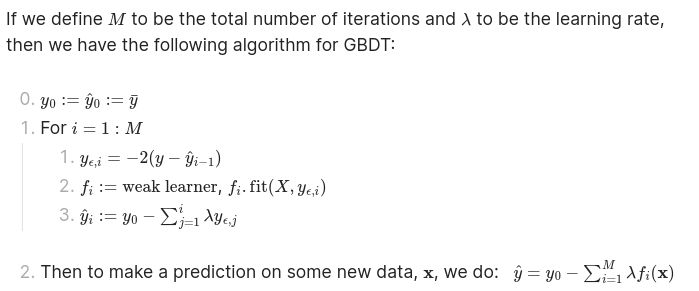

# Decision Trees

## Content

We implement regression decision trees:
1. Base decision tree class
2. Ensemble decision tree class
3. Random Forest decision tree class
4. Gradient Boosted decision tree class

Note: these are just toy implementations and are slow and shouldn't be used
for actual projects.

## Theory

